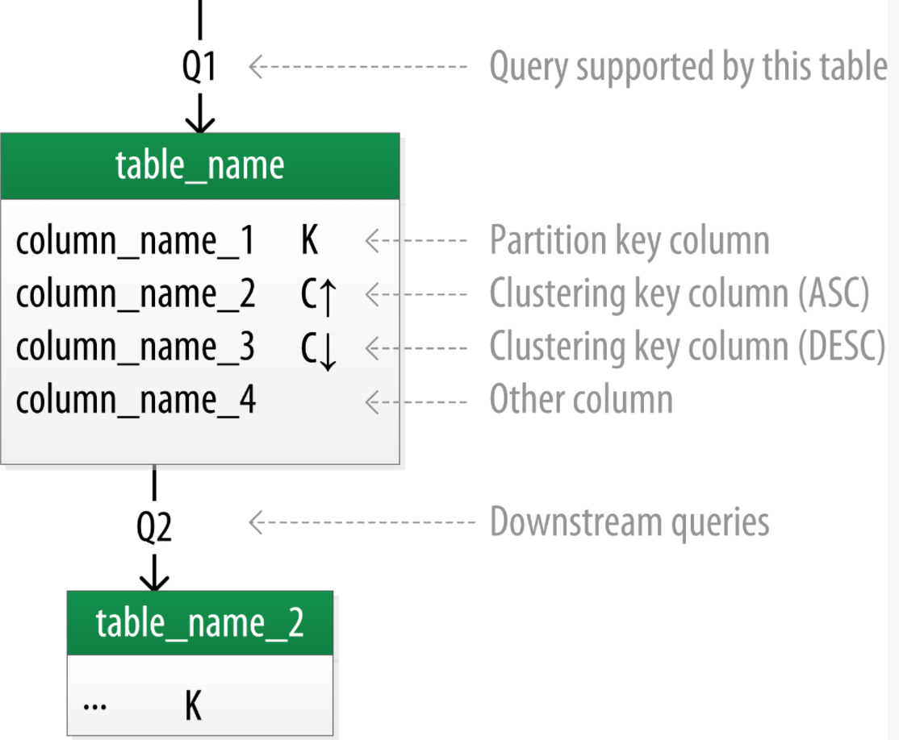
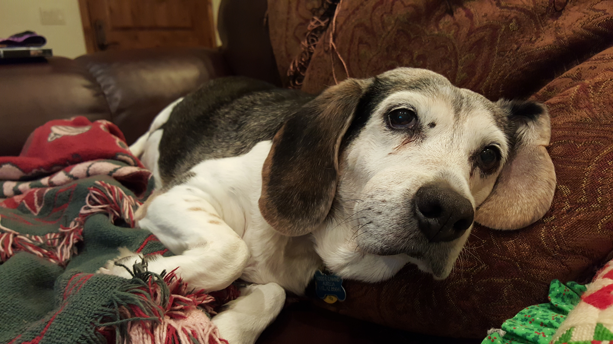
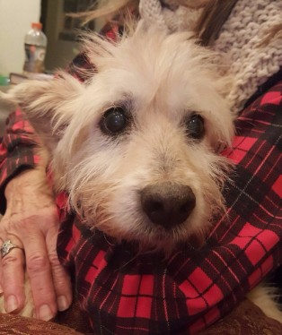
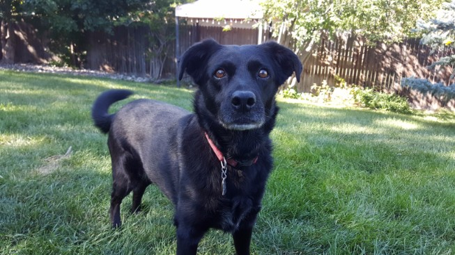

---
# Cassandra
 A fully distributed, masterless database, offering superior scalability,
 and fault tolerance to traditional single-master databases

---
# Key Differences
## No Joins


---


---


---
# Key Differences
## No guaranteed referential integrity


---
# Key Differences

## Query-First Design


---
# Key Differences

## Designing for optimal storage

---
## Why not relational databases?

#### - Not designed for clustered solutions
#### - Not a good fit for current hardware and architectures

---
# Solutions
- Clustering
- Flexible Schema
- Relax consistency
- Denormalization of data


---
# Horizontal scalability


---
# High availability


---
# CAP
- Consistency - Every read receives the most recent write or an error
- Availability -Every request receives a (non-error) response – without guarantee that it contains the most recent write
- Partition Tolerance - The system continues to operate despite an arbitrary number of messages being dropped (or delayed) by the network between nodes
---
# Write Optimization


---
# Efficient result ordering


---
### Eventual vs. Immediate Consistency


---
# Creating a keyspace


---

- ```CREATE DATABASE dogWalking;```

- ``` CREATE KEYSPACE dogWalking WITH replication = {'class': 'SimpleStrategy', 'replication_factor': 1};```

---
``` 
CREATE TABLE dogwalker ( 
    id UUID PRIMARY KEY,
    name text,
    email text,
    phoneNumber text,
    neighborhood text
); 
CREATE TYPE dog ( 
    id UUID,
    name text,
    breed text,
    age int,
); 
```

---
``` 
CREATE TABLE dogowner ( 
    id UUID PRIMARY KEY,
    name text,
    email text,
    phoneNumber text,
    neighborhood text
    dogs frozen list<<dog>>
);
```

---
# Thank You!


