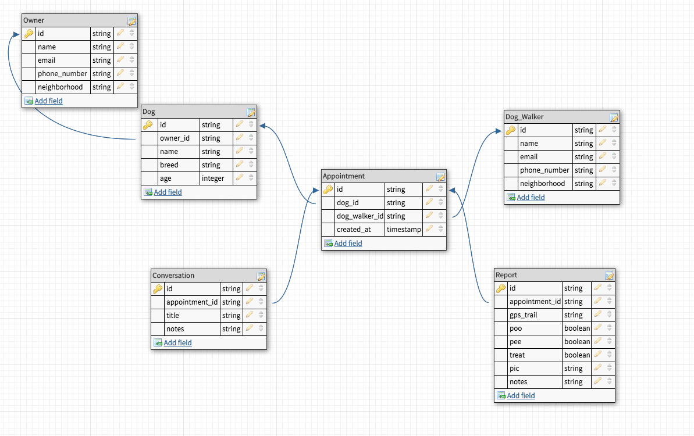

---

# Key Differences
## No Joins

---

---
# Key Differences
## No guaranteed referential integrity

---
# Key Differences

## Query-First Design

---
# Key Differences

## Designing for optimal storage

---
## Why not relational databases?

#### - Not designed for clustered solutions
#### - Not a good fit for current hardware and architectures

---
# Solutions
- Clustering
- Flexible Schema
- Relax consistency
- Denormalization of data
.jpg)

---
# Cassandra
 A fully distributed, masterless database, offering superior scalability,
 and fault tolerance to traditional single-master databases

---
# Horizontal scalability

---

# High availability

---
# Write Optimization

---
# Efficient result ordering

---
# Immediate Consistency

---
# Creating a keyspace
